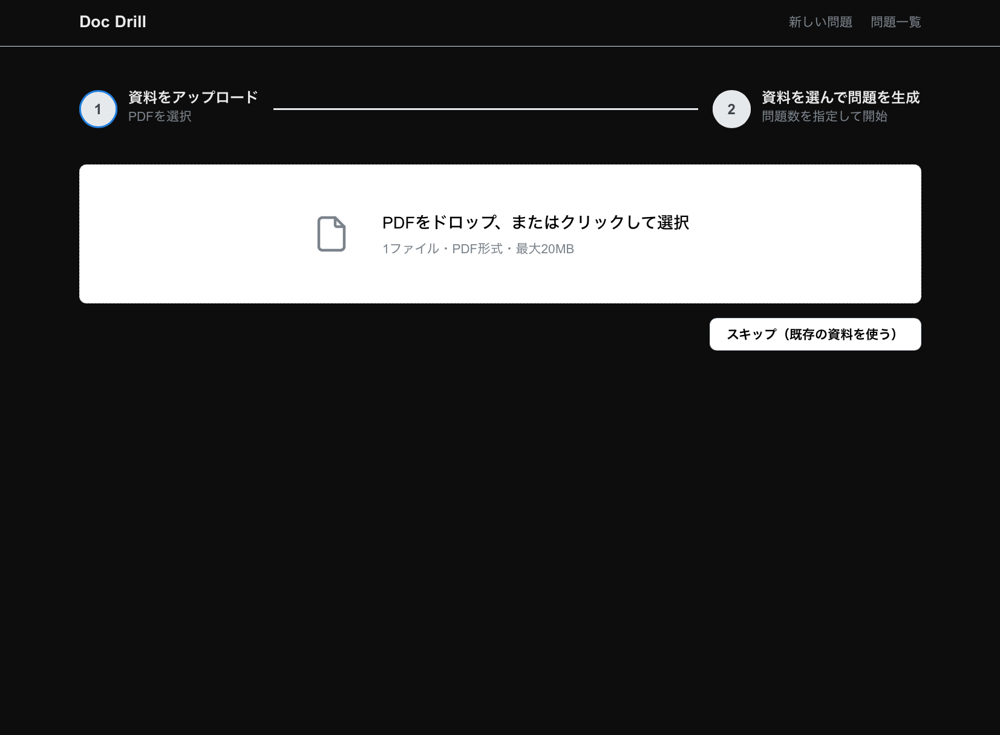
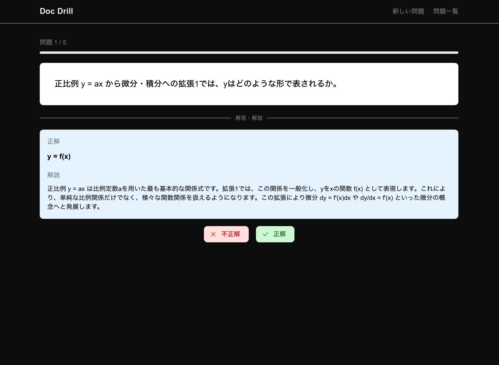
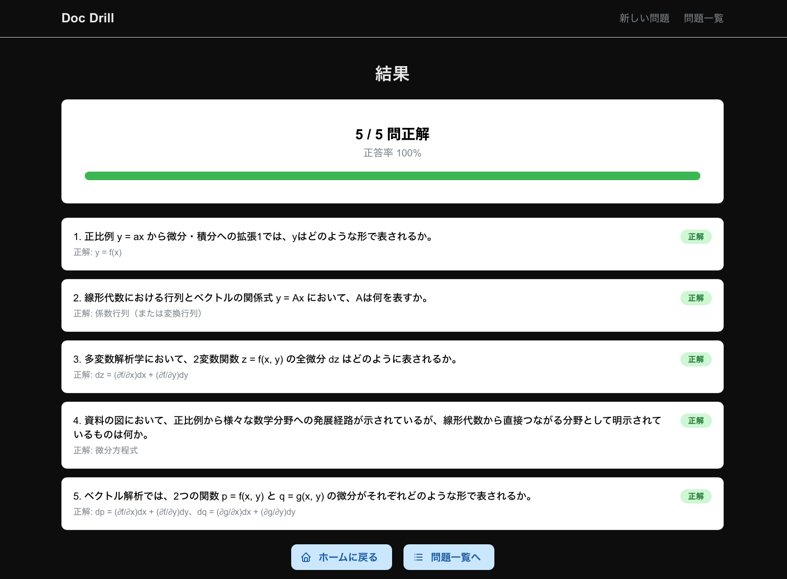

# doc-drill

PDF などのドキュメントをアップロードし、RAG を用いて自動生成された問題を解くことで学習を効率化する Web アプリケーション。

## 目的

フルスタック開発・AWSインフラ構築・IaC の実践的な習得を主目的としたプロジェクト。アプリはその「乗り物」と位置づけ、スケーラブルなアーキテクチャ設計に重点を置く。

## 主な機能

- PDF ドキュメントのアップロード・管理
- Bedrock (Claude) による問題・解説の自動生成
- 生成した問題の保存と再演習

## デモ

> APIコスト削減のため、本番環境は常時稼働していません。以下のスクリーンショットで動作イメージをご確認ください。

<div align="center">
  
  
  
</div>


## 技術スタック

| レイヤー | 技術 |
|---|---|
| Frontend | Next.js (TypeScript) + Mantine UI |
| Backend | FastAPI (Python) |
| Database | RDS PostgreSQL 16 |
| Storage | Amazon S3 |
| AI / RAG | Amazon Bedrock (Claude) + Knowledge Bases（Phase 6 で pgvector に移行予定） |
| Infra | AWS ECS Fargate, VPC, ALB, IAM |
| IaC | Terraform |
| Dev | Docker, Docker Compose |

## アーキテクチャ概要


## 実装ロードマップ

| フェーズ | 内容 | 状態 |
|---|---|---|
| Phase 1 | ローカル開発基盤（Docker Compose, モノレポ構成） | 完了 |
| Phase 2 | バックエンド実装（FastAPI, Bedrock 連携） | 完了 |
| Phase 3 | フロントエンド実装（Next.js） | 完了 |
| Phase 4 | AWSインフラ構築（Terraform） | 完了 |
| Phase 5 | デプロイ・結合確認（ECR push → terraform apply → E2E 動作確認） | 完了 |
| Phase 6 | 自作 RAG パイプラインへの置き換え（Bedrock KB 廃止・pgvector 化） | 未着手 |
| Phase 7 | CI/CD パイプラインの整備（GitHub Actions + ECS 自動デプロイ） | 未着手 |

## ローカル起動

```bash
cp .env.example .env
# .env に POSTGRES_USER / POSTGRES_PASSWORD / POSTGRES_DB / MINIO_ROOT_USER / MINIO_ROOT_PASSWORD を設定
docker compose up --build
```

| サービス | URL |
|---|---|
| Frontend | http://localhost:3000 |
| Backend API | http://localhost:8000 |
| MinIO Console | http://localhost:9001 |

> Bedrock 連携はデフォルト無効（`BEDROCK_KB_ENABLED=false`）。AWS 環境へのデプロイ時は `.env` で有効化する。

## ドキュメント

| ドキュメント | 内容 |
|---|---|
| [プロジェクト構造](docs/structure.md) | ディレクトリ構成・作業別の参照先ガイド |
| [技術選定](docs/adr.md) | ADR（技術選定の意思決定記録） |
| [アーキテクチャ](docs/architecture.md) | AWS 詳細構成（Phase 4 で整備予定） |
| [仕様](docs/spec.md) | アプリ仕様・APIエンドポイント一覧 |

## ライセンス

MIT
