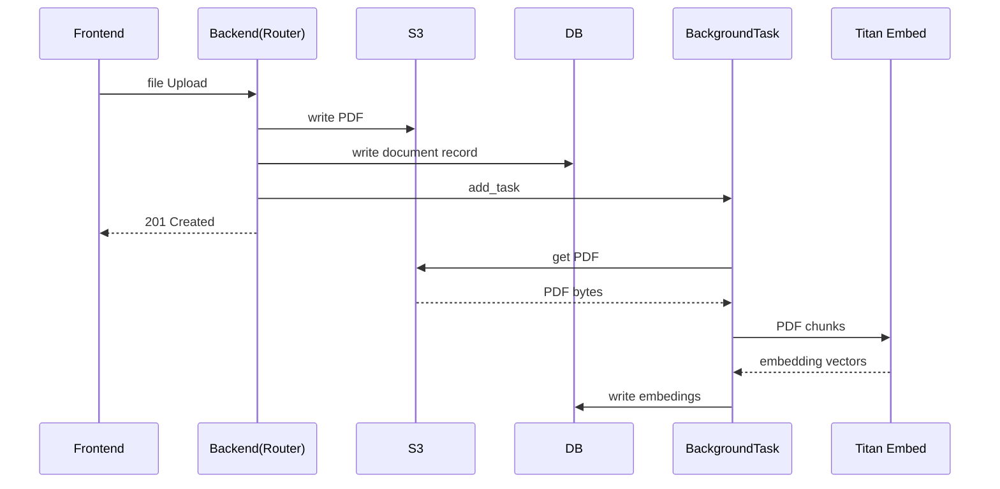
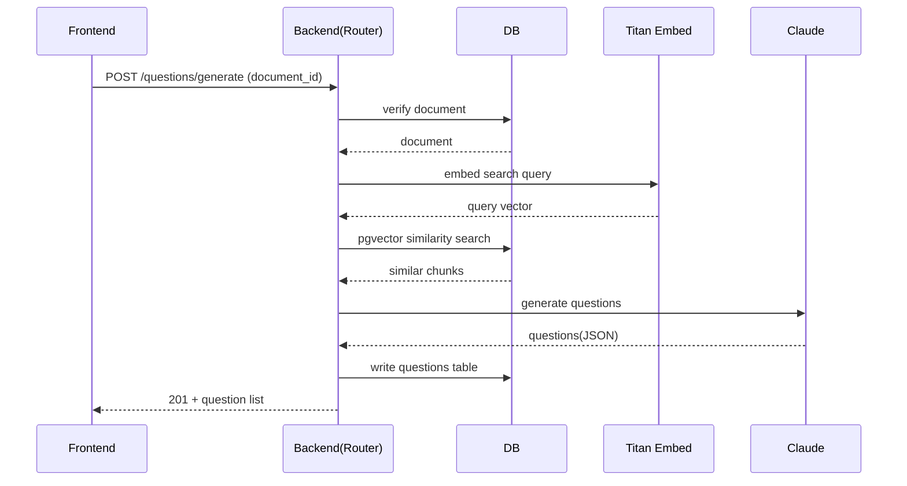

# アーキテクチャ設計

---

## コンポーネント図

## ネットワークトポロジー

---

## RAGパイプライン（シーケンス）

### PDFアップロード時

### 問題生成時

---

## ネットワーク設計（VPC）

### 基本情報

| 項目 | 値 |
|---|---|
| リージョン | ap-northeast-1 |
| VPC CIDR | 10.0.0.0/16 |
| AZ | ap-northeast-1a / ap-northeast-1c（2AZ構成） |

### サブネット一覧

| 名前 | CIDR | AZ | 用途 |
|---|---|---|---|
| public-a | 10.0.0.0/24 | 1a | ALB、NAT Gateway |
| public-c | 10.0.1.0/24 | 1c | ALB |
| private-a | 10.0.10.0/24 | 1a | ECS タスク（frontend / backend） |
| private-c | 10.0.11.0/24 | 1c | ECS タスク（frontend / backend） |
| db-a | 10.0.20.0/24 | 1a | RDS PostgreSQL 16 |
| db-c | 10.0.21.0/24 | 1c | RDS PostgreSQL 16 |

### ルーティング

- Public subnet → Internet Gateway（インターネット直接アクセス）
- Private subnet → NAT Gateway（ECRイメージプル・Bedrock API呼び出しに必要）
- DB subnet → ルートなし（インターネット非接続）

---

## セキュリティグループ設計

| SG名 | インバウンド | 対象 |
|---|---|---|
| frontend-alb-sg | 0.0.0.0/0 → :80 | フロントエンド用ALB |
| backend-alb-sg | 0.0.0.0/0 → :80 | バックエンド用ALB |
| frontend-ecs-sg | frontend-alb-sg → :3000 | Next.js ECSタスク |
| backend-ecs-sg | backend-alb-sg → :8000 | FastAPI ECSタスク |
| db-sg | backend-ecs-sg → :5432 | RDS |

---

## ALB 設計

2つのPublic ALBを用意し、開発・デバッグ時にバックエンドを直接操作できるようにする。

| ALB名 | リスナー | ターゲットグループ | ヘルスチェックパス |
|---|---|---|---|
| doc-drill-frontend | HTTP:80 | Next.js ECS :3000 | `/` |
| doc-drill-backend | HTTP:80 | FastAPI ECS :8000 | `/health` |

> Phase 5 でACM証明書取得後、HTTPS:443リスナーを追加してHTTPをリダイレクトする。

---

## ECR（コンテナレジストリ）

| リポジトリ名 | 対象 |
|---|---|
| doc-drill/frontend | Next.js コンテナイメージ |
| doc-drill/backend | FastAPI コンテナイメージ |

---

## ECS 設計

### クラスター

| 項目 | 値 |
|---|---|
| クラスター名 | doc-drill |
| 起動タイプ | Fargate |

### タスク定義・サービス

#### frontend

| 項目 | 値 |
|---|---|
| タスク定義名 | doc-drill-frontend |
| コンテナポート | 3000 |
| CPU / メモリ | 256 / 512（開発用最小構成） |
| ログ送信先 | CloudWatch: /ecs/doc-drill/frontend |

**環境変数（ECS タスク定義に設定）:**

| 変数 | 値 |
|---|---|
| `NEXT_PUBLIC_API_URL` | `http://{backend-alb-dns}` |
| `HOSTNAME` | `0.0.0.0` |

#### backend

| 項目 | 値 |
|---|---|
| タスク定義名 | doc-drill-backend |
| コンテナポート | 8000 |
| CPU / メモリ | 512 / 1024（Bedrock呼び出しを含むため） |
| ログ送信先 | CloudWatch: /ecs/doc-drill/backend |

**環境変数（ECS タスク定義に設定）:**

| 変数 | 値 | 備考 |
|---|---|---|
| `DATABASE_URL` | Secrets Manager参照 | IAMで取得、平文設定不可 |
| `S3_BUCKET` | `doc-drill-{account_id}` | |
| `AWS_DEFAULT_REGION` | `ap-northeast-1` | |
| `CORS_ORIGINS` | `["http://{frontend-alb-dns}"]` | フロントALBのDNSをTerraformで注入 |

**設定しない変数（ローカルとの差分）:**

| 変数 | 理由 |
|---|---|
| `S3_ENDPOINT_URL` | 実S3はエンドポイント指定不要 |
| `AWS_ACCESS_KEY_ID` | IAMタスクロールで自動解決 |
| `AWS_SECRET_ACCESS_KEY` | IAMタスクロールで自動解決 |
| `BEDROCK_AWS_ACCESS_KEY_ID` | IAMタスクロールで自動解決 |
| `BEDROCK_AWS_SECRET_ACCESS_KEY` | IAMタスクロールで自動解決 |

---

## IAM 設計

### ECS タスク実行ロール（Task Execution Role）

両サービス共通。ECSがコンテナを起動するための権限。

| ポリシー | 用途 |
|---|---|
| `AmazonECSTaskExecutionRolePolicy` | ECRからのイメージプル・CloudWatch Logsへの書き込み |
| `secretsmanager:GetSecretValue` | DB接続情報の取得（Secrets Manager） |

### バックエンド タスクロール（Task Role）

FastAPIコンテナ自身がAWSサービスを呼び出すための権限。

| アクション | リソース | 用途 |
|---|---|---|
| `s3:GetObject` `s3:PutObject` `s3:DeleteObject` `s3:ListBucket` | doc-drillバケット | PDF保存・取得・削除 |
| `bedrock:InvokeModel` | 東京リージョンの foundation model ARN・jp.* クロスリージョン推論プロファイル・大阪リージョンの foundation model ARN・Titan Embed ARN | 問題生成・埋め込み |

### フロントエンド タスクロール

Next.jsはバックエンドをHTTPで呼ぶだけのためAWSサービス呼び出しなし。タスクロール不要（Execution Roleのみ）。

---

## S3 設計

| 項目 | 値 |
|---|---|
| バケット名 | `doc-drill-{aws_account_id}`（グローバル一意性のためaccount_idをサフィックスに） |
| パブリックアクセス | 全てブロック |
| 用途 | PDF保存（`documents/` プレフィックス） |

---

## RDS 設計

| 項目 | 値 |
|---|---|
| エンジン | postgres（pgvector拡張） |
| バージョン | 16.6 |
| インスタンスクラス | db.t3.micro |
| ストレージ | 20GB (gp2) |
| サブネットグループ | db-a / db-c |
| セキュリティグループ | db-sg |
| マスターパスワード | Secrets Manager で管理 |

**Secrets Manager シークレット名:** `doc-drill/db-password`

---

## RAGパイプライン設計

| 項目 | 値 |
|---|---|
| 埋め込みモデル | `amazon.titan-embed-text-v2:0`（Bedrock InvokeModel） |
| ベクターストア | pgvector（RDS PostgreSQL 16拡張） |
| チャンクサイズ | 500文字・オーバーラップ100文字 |
| インデックス型 | HNSW |
| 埋め込み次元数 | 1024 |
| ingestion方式 | FastAPI `BackgroundTasks`（非同期） |

---

## ローカル vs AWS 環境差分サマリ

| コンポーネント | ローカル | AWS |
|---|---|---|
| オブジェクトストレージ | MinIO（Docker） | Amazon S3 |
| DB | PostgreSQL 16（Docker） | RDS PostgreSQL 16（db.t3.micro） |
| AWS認証 | 環境変数（access key） | IAMタスクロール |
| バックエンドURL | `http://localhost:8000` | `http://{backend-alb-dns}` |
| DB接続情報 | `.env` ファイル | Secrets Manager |
