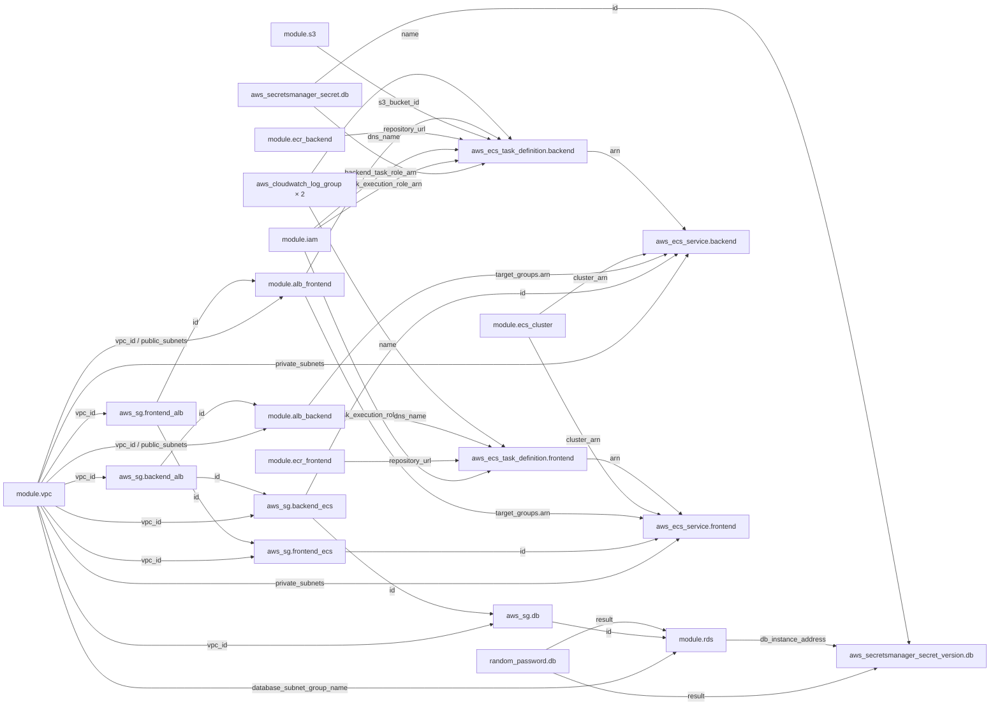

# インフラ リソース依存グラフ

各モジュール・リソースの **outputs が他の variables / inputs としてどう参照されているか**を示す。エッジのラベルは参照されている output 名。

## 依存関係のポイント

**SG チェーン（ingress source に別 SG の id を使う）**
`frontend_ecs_sg` のインバウンドルールは `security_groups = [aws_security_group.frontend_alb.id]` で書かれている。SG の id を参照することで ALB 経由のトラフィックだけを許可しつつ、`frontend_alb_sg` の作成完了を Terraform に伝える依存が自動的に生じる。

**ALB の dns_name が Task Definition の env var に注入される**
`module.alb_frontend.dns_name` が backend の `CORS_ORIGINS` に、`module.alb_backend.dns_name` が frontend の `NEXT_PUBLIC_API_URL` に渡される。ALB が完成して DNS 名が確定するまで Task Definition を作れないというクロスモジュール参照の典型例。

**`aws_secretsmanager_secret` と `_version` の分離**
`secret_version.secret_string` に `module.rds.db_instance_address` を埋め込む。RDS 作成前はエンドポイントが確定しないため、領域確保（`secret`）と値格納（`secret_version`）をリソースとして分離している。

**ECR の repository_url は URL だけを渡す**
`aws_ecs_task_definition` の `image` に `module.ecr_backend.repository_url` を参照しているが、Terraform が管理するのはリポジトリ（URL）の存在だけ。イメージの push は CI/CD（GitHub Actions）の責務であり、apply 時点ではイメージが存在しない場合もある。

**`lifecycle { ignore_changes }` の意図**
`aws_ecs_service` に `ignore_changes = [task_definition, desired_count]` を設定し、CI/CD によるローリングデプロイを Terraform が上書きしないようにしている。インフラ管理（Terraform）とデプロイ管理（CI/CD）の責務を分離する設計。
