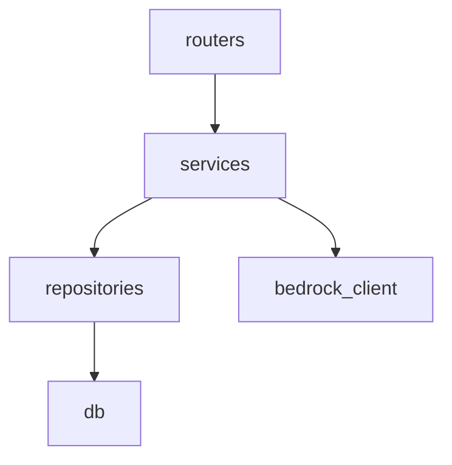
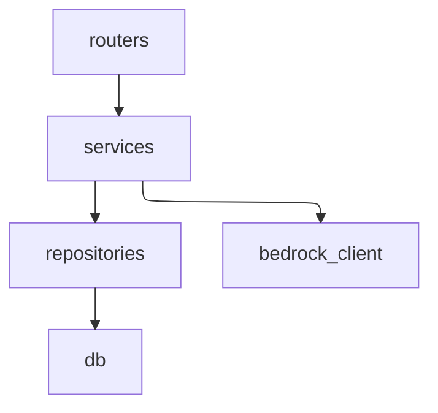

# 目的・前提・方針案

モジュール間の依存関係やその方向などを明示的にドキュメント化することでAIのコード生成精度を向上できないかと考えたのですが、これに適する手法などは存在しますか？

既に採用済みのアーキテクチャをadr.md, architecture.mdから取得し、その相性なども考慮した記法選定を行いたいです。

これは調査タスクであり、最初はWebSearch系を行い、比較検討したいと考えています。いきなり具体的なドキュメント作成方針を練る必要はないです


# 計画

## Phase 1: WebSearch調査
- [x] コード内モジュール依存ドキュメント手法の調査（C4 Model Component/Code level、Mermaid、DSL系など）
- [x] AIコード生成精度とコンテキストドキュメント構造の関係調査
- [x] FastAPI/Next.js向けツール・自動生成ツールと手書き記法の調査

## Phase 2: 比較・選定
- [x] 手法比較表作成（記法の有無・自動生成可否・設計段階での利用可否・LLMとの相性）
- [x] 既存 `architecture.md` / `adr.md` スタイルとの整合性評価＋有望手法の選定

# 実行過程

（WebSearch 6クエリ、追加調査なし）

# 結果

## 手法比較表

| 手法 | 記法 | 自動生成 | 設計段階利用 | LLM相性 | 既存スタイル整合 | 対象層 |
|---|---|---|---|---|---|---|
| **Mermaid flowchart** | ✅ テキスト | ✅（一部ツール） | ✅ | ✅ 高 | ✅ | Python / JS |
| **importlinter** | ✅ TOML | ✅（違反検知） | ✅（制約先定義） | △ | △ | Python |
| C4 Model（Structurizr DSL） | ✅ DSL | ✅ | ✅ | △ | △（別ファイル） | 言語非依存 |
| PlantUML（py2puml） | ✅ テキスト | ✅（Python） | ✅ | △ | △（別ファイル） | Python |
| pydeps | ❌ SVGのみ | ✅（Python） | ❌ | ❌ バイナリ | ❌ | Python |
| madge | ❌ SVGのみ | ✅（JS/TS） | ❌ | ❌ バイナリ | ❌ | JS/TS |
| Knowledge Graph（Graphify等） | ❌ JSON | ✅ | ❌ | ✅ 高 | ❌ | 言語非依存 |

## 有望手法

### 第一候補：Mermaid flowchart（手書き記法 ＋ 検証ツール補助）

**根拠：**
- テキストベースでLLMが直接読める（arxiv:2505.14394等でも構造的文脈がLLM精度を有意に向上させると報告）
- 既存 `architecture.md` のMarkdown・表スタイルと一貫性が取れる。GitHubでもレンダリング可能
- 設計段階でまず手書きし、`pydeps`（Python）・`madge`（TS）の出力と照合して乖離を検証するフローが成立する

**記法例：**


### 補完：importlinter（依存ルールのコード化・CI強制）

**根拠：**
- Mermaid図で定義した依存ルールを `.importlinter` (TOML) に落とし込み、CI で違反検知できる
- 設計（記述）→ 実装 → 検証 の一貫フローが完成する
- LLMへのコンテキスト提供というより、設計と実装の乖離防止が主目的

**設定例：**
```toml
[importlinter]
root_packages = app

[[importlinter.contracts]]
name = routers → services のみ許可
type = layers
layers = routers | services | repositories
```

### レイアウト改善：Mermaid + ELK レンダラー

Mermaid のデフォルトレイアウトエンジン（Dagre）は複雑なグラフで配置が不自然になりやすい。先頭に1行追加するだけで **ELK（Eclipse Layout Kernel）** に切り替え可能。



- draw.io も Mermaid + ELK に対応済み（import 時にそのままレンダリング可能）
- 記法・LLM相性はそのまま維持される
- ELK は v9.4 から実験的機能として追加。GitHub 等のレンダラーは未対応の場合あり（ローカルまたは draw.io でのレンダリング推奨）

さらに高品質なレイアウトが必要な場合は **D2 + TALA** が有力だが、LLMの構文習熟度が低い・TALA は有料のため、まず ELK を試すことを推奨。

### 検証ツール（出力はLLM文脈には不適、設計との差分確認用）
- **pydeps**：`pydeps app/` で Python モジュール依存 SVG を生成。設計Mermaidとの目視比較に使う
- **madge**：`madge src/ --image graph.svg` で TS モジュール依存 SVG を生成。同上